# ПОЯСНИТЕЛЬНАЯ ЗАПИСКА
## Приложение «Учёт личных расходов»

---

## 1. ОПИСАНИЕ ПРОЕКТА

Приложение **«Учёт личных расходов»** — это десктопное приложение для ведения личного финансового учёта, разработанное на Python с использованием библиотеки PyQt6. Приложение позволяет пользователям регистрироваться, входить в систему, вести учёт доходов и расходов, просматривать статистику и экспортировать отчёты.

### Основные характеристики:
- **Платформа**: Windows, Linux, macOS
- **Язык программирования**: Python 3
- **Графический интерфейс**: PyQt6
- **База данных**: SQLite
- **Архитектура**: Многооконное приложение с разделением на модули

---

## 2. ВОЗМОЖНОСТИ ПРИЛОЖЕНИЯ

### 2.1. Система авторизации
- **Регистрация новых пользователей** — создание учётной записи с уникальным именем пользователя и паролем
- **Вход в систему** — авторизация существующих пользователей
- **Проверка данных** — валидация введённых данных при регистрации и входе
- **Изоляция данных** — каждый пользователь видит только свои транзакции

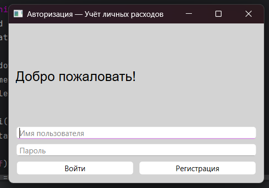

### 2.2. Управление транзакциями
- **Добавление транзакций**:
  - Выбор типа операции (доход или расход)
  - Выбор категории из предустановленного списка
  - Ввод суммы (поддержка десятичных чисел)
  - Выбор даты через календарь
  - Добавление описания (опционально)
  
- **Редактирование транзакций**:
  - Выбор записи из таблицы
  - Изменение всех полей транзакции
  - Сохранение изменений
  
- **Удаление транзакций**:
  - Выбор записи для удаления
  - Подтверждение удаления через диалоговое окно
  
- **Просмотр транзакций**:
  - Отображение всех транзакций в таблице
  - Сортировка по любому столбцу (клик по заголовку)
  - Цветовое выделение: доходы — зелёным, расходы — красным

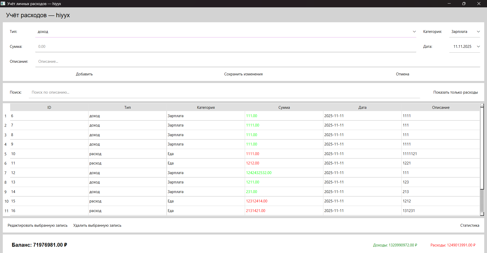

### 2.3. Фильтрация и поиск
- **Поиск по описанию** — быстрый поиск транзакций по тексту описания
- **Фильтр по типу** — отображение только расходов (чекбокс "Показать только расходы")
- **Комбинированная фильтрация** — одновременное использование поиска и фильтра по типу

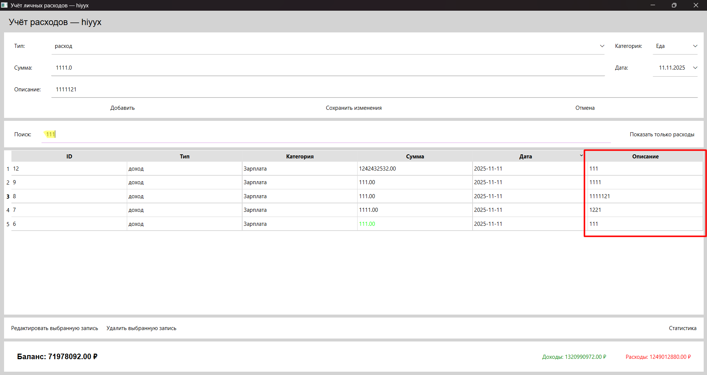

### 2.4. Финансовая статистика
- **Текущий баланс** — автоматический расчёт баланса (доходы минус расходы)
- **Сумма доходов** — общая сумма всех доходов
- **Сумма расходов** — общая сумма всех расходов
- **Отображение в реальном времени** — обновление статистики при каждом изменении данных

### 2.5. Окно статистики
- **Статистика по категориям**:
  - Группировка расходов по категориям
  - Отображение суммы расходов для каждой категории
  - Сортировка по сумме (по убыванию)
  - Итоговая сумма всех расходов
  
- **Экспорт отчёта**:
  - Генерация текстового отчёта в файл `report.txt`
  - Включение статистики по категориям
  - Общая статистика (доходы, расходы, баланс)
  - Детальный список всех транзакций с датами и описаниями

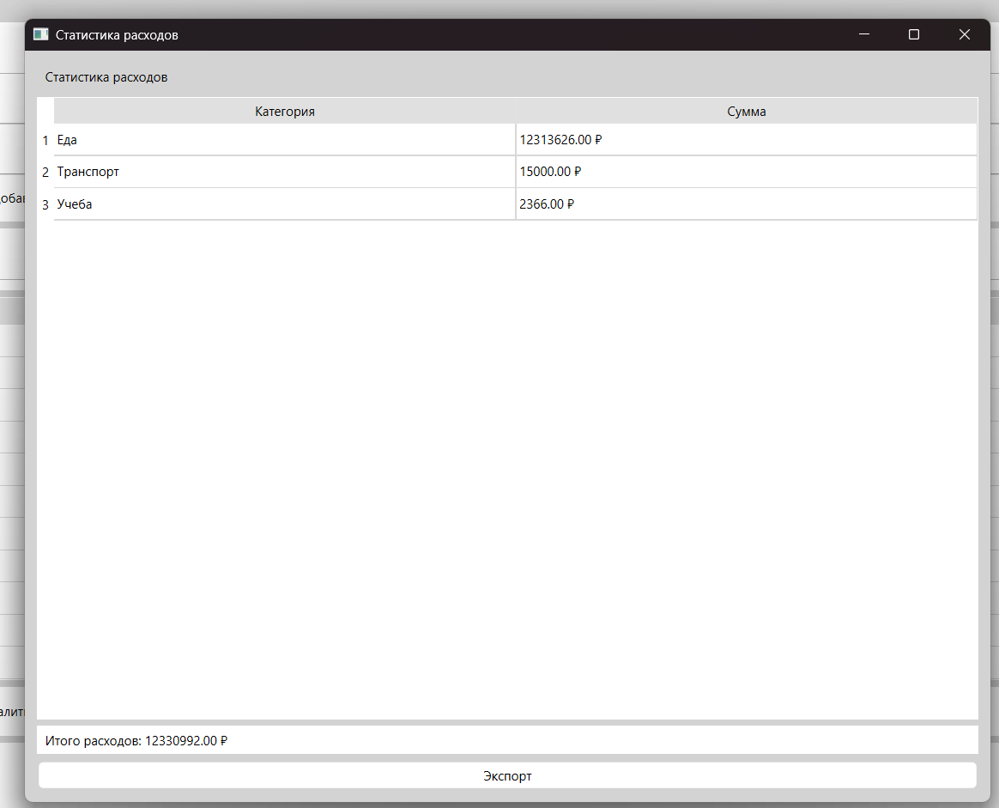

### 2.6. Предустановленные категории
При регистрации пользователю автоматически создаются категории:

**Доходы:**
- Зарплата
- Подарки
- Инвестиции
- Прочее

**Расходы:**
- Еда
- Транспорт
- Жильё
- Здоровье
- Учёба
- Прочее

---

## 3. ИНСТРУКЦИЯ ПО РАБОТЕ С ПРИЛОЖЕНИЕМ

### 3.1. Запуск приложения

1. Убедитесь, что установлен Python 3.7 или выше
2. Установите зависимости из файла `requirements.txt`:
   ```
   pip install -r requirements.txt
   ```
3. Запустите приложение:
   ```
   python main.py
   ```

### 3.2. Регистрация нового пользователя

1. При первом запуске откроется окно авторизации (рис. 1)
2. Введите желаемое имя пользователя в поле "Имя пользователя"
3. Введите пароль в поле "Пароль"
4. Нажмите кнопку **"Регистрация"**
5. При успешной регистрации появится сообщение об успехе (рис. 2)
6. После регистрации автоматически создаются категории по умолчанию


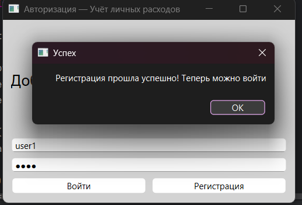

**⚠️ ВАЖНО:** Имя пользователя должно быть уникальным. Если пользователь с таким именем уже существует, появится сообщение об ошибке.

### 3.3. Вход в систему

1. Введите зарегистрированное имя пользователя
2. Введите пароль
3. Нажмите кнопку **"Войти"**
4. При успешном входе откроется главное окно приложения (рис. 3)

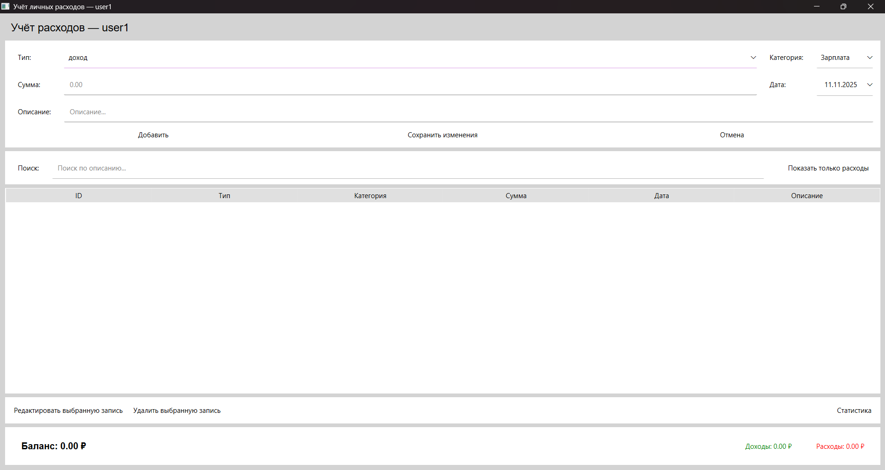

### 3.4. Добавление транзакции

1. В главном окне заполните форму (рис. 4):
   - **Тип**: выберите "доход" или "расход" из выпадающего списка
   - **Категория**: выберите категорию (список зависит от выбранного типа)
   - **Сумма**: введите сумму (можно использовать точку или запятую как разделитель)
   - **Дата**: выберите дату через календарь (по умолчанию — текущая дата)
   - **Описание**: введите описание транзакции (необязательно)
   
2. Нажмите кнопку **"Добавить"**
3. Транзакция появится в таблице, баланс обновится автоматически (рис. 5)

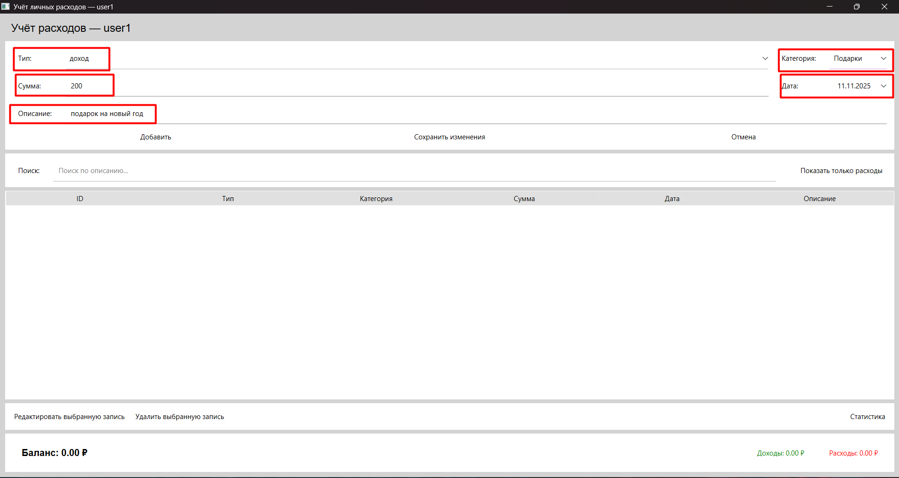


### 3.5. Редактирование транзакции

1. Выберите строку с транзакцией в таблице (кликните на любую ячейку строки)
2. Нажмите кнопку **"Редактировать выбранную запись"**
3. Форма заполнится данными выбранной транзакции (рис. 6)
4. Измените нужные поля
5. Нажмите кнопку **"Сохранить изменения"**
6. Для отмены редактирования нажмите **"Отмена"**

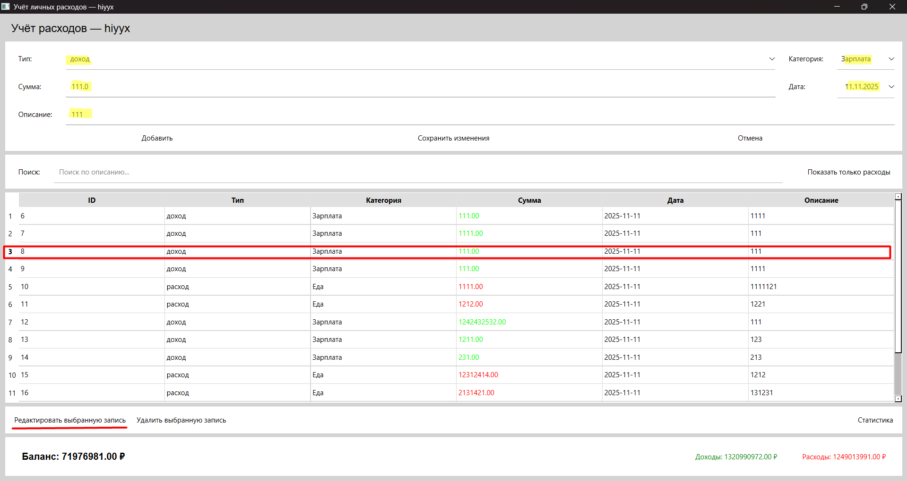

### 3.6. Удаление транзакции

1. Выберите строку с транзакцией в таблице
2. Нажмите кнопку **"Удалить выбранную запись"**
3. Подтвердите удаление в появившемся диалоговом окне (рис. 7)
4. Транзакция будет удалена, баланс обновится автоматически

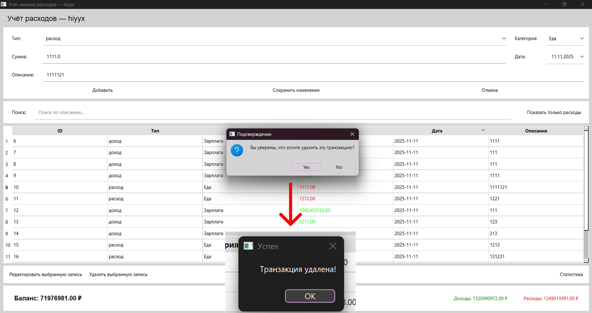

### 3.7. Поиск и фильтрация

**Поиск по описанию:**
- Введите текст в поле "Поиск" в верхней части окна
- Таблица автоматически обновится, показывая только транзакции, содержащие введённый текст в описании

**Фильтр по типу:**
- Установите галочку "Показать только расходы"
- Таблица покажет только транзакции типа "расход"
- Снимите галочку, чтобы увидеть все транзакции

**Комбинированная фильтрация:**
- Можно одновременно использовать поиск и фильтр по типу


### 3.8. Просмотр статистики

1. Нажмите кнопку **"Статистика"** в главном окне
2. Откроется окно статистики с таблицей расходов по категориям (рис. 9)
3. В таблице отображается:
   - Название категории
   - Сумма расходов по этой категории
4. Внизу окна отображается итоговая сумма всех расходов
5. Таблицу можно сортировать, кликнув по заголовку столбца


### 3.9. Экспорт отчёта

1. Откройте окно статистики (кнопка "Статистика")
2. Нажмите кнопку **"Экспорт"**
3. Отчёт будет сохранён в файл `report.txt` в корневой папке проекта
4. Появится сообщение об успешном экспорте с количеством транзакций (рис. 10)

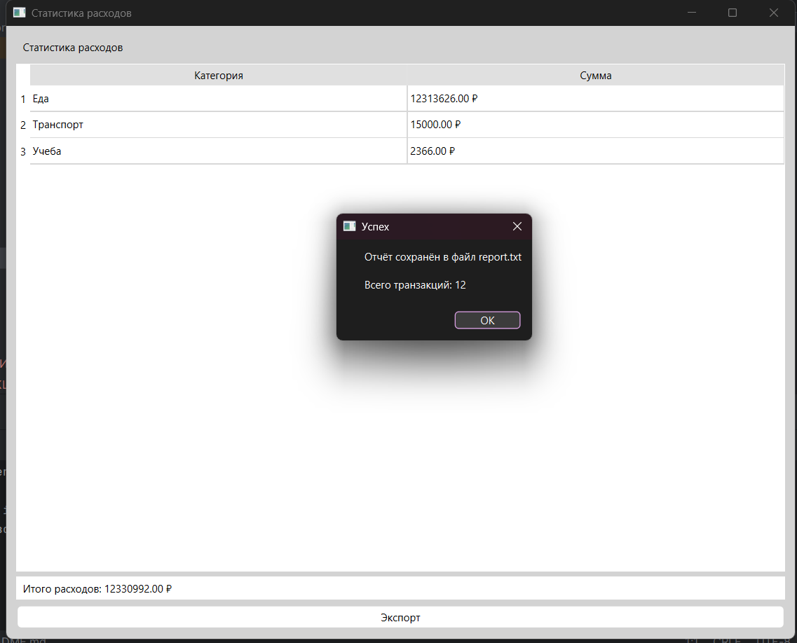

**Содержимое отчёта:**
- Заголовок и дата формирования
- Статистика по категориям расходов
- Общая статистика (доходы, расходы, баланс)
- Детальный список всех транзакций с датами, типами, категориями, суммами и описаниями

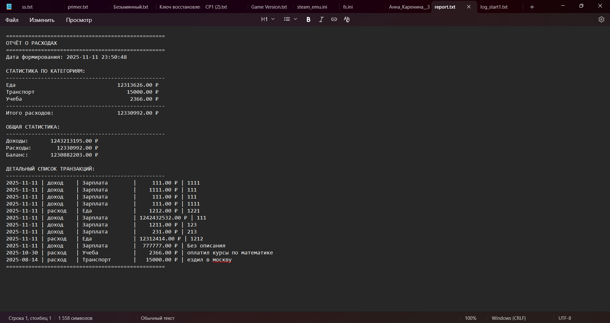

### 3.10. Сортировка таблицы

- Кликните по заголовку любого столбца для сортировки по этому столбцу
- Повторный клик изменит направление сортировки (по возрастанию/убыванию)
- Доступна сортировка по: ID, Типу, Категории, Сумме, Дате, Описанию

---

## 4. ТЕХНИЧЕСКИЕ ДЕТАЛИ

### 4.1. Структура проекта

```
expense_accousting/
├── main.py                 # Точка входа приложения
├── requirements.txt        # Зависимости проекта
├── code/
│   ├── __init__.py
│   ├── auth_window.py      # Окно авторизации
│   ├── main_window.py      # Главное окно
│   ├── statistics_window.py # Окно статистики
│   └── database.py         # Работа с базой данных
├── database/
│   └── database.db         # База данных SQLite
├── res/                    # Папка со скриншотами
│   ├── auth_window.png
│   ├── registration_success.png
│   ├── main_window_empty.png
│   ├── form_filled.png
│   ├── transactions_table.png
│   ├── edit_transaction.png
│   ├── delete_confirm.png
│   ├── search_filter.png
│   ├── statistics_window.png
│   ├── export_success.png
│   └── report_file.png
└── report.txt              # Экспортированный отчёт (создаётся при экспорте)
```

### 4.2. Структура базы данных

**Таблица `users`:**
- `id` (INTEGER, PRIMARY KEY) — уникальный идентификатор пользователя
- `username` (TEXT, UNIQUE) — имя пользователя
- `password` (TEXT) — пароль

**Таблица `categories`:**
- `id` (INTEGER, PRIMARY KEY) — уникальный идентификатор категории
- `name` (TEXT) — название категории
- `type` (INTEGER) — тип категории (0 — доход, 1 — расход)
- `user_id` (INTEGER, FOREIGN KEY) — идентификатор пользователя

**Таблица `transactions`:**
- `id` (INTEGER, PRIMARY KEY) — уникальный идентификатор транзакции
- `user_id` (INTEGER, FOREIGN KEY) — идентификатор пользователя
- `category_id` (INTEGER, FOREIGN KEY) — идентификатор категории
- `type` (INTEGER) — тип транзакции (0 — доход, 1 — расход)
- `amount` (REAL) — сумма транзакции
- `date` (TEXT) — дата транзакции (формат: YYYY-MM-DD)
- `description` (TEXT) — описание транзакции

### 4.3. Используемые технологии

- **Python 3** — язык программирования
- **PyQt6** — библиотека для создания графического интерфейса
- **SQLite3** — встроенная база данных
- **Qt Designer** (не используется, но может быть полезен) — визуальный редактор интерфейсов

### 4.4. Зависимости

- `PyQt6>=6.6.0` — библиотека для создания GUI

---

## 5. ОСОБЕННОСТИ РЕАЛИЗАЦИИ

### 5.1. Безопасность
- Пароли хранятся в открытом виде (для учебного проекта)
- В продакшн-версии рекомендуется использовать хеширование паролей

### 5.2. Валидация данных
- Проверка заполнения обязательных полей
- Проверка корректности суммы (должна быть положительным числом)
- Проверка уникальности имени пользователя при регистрации

### 5.3. Пользовательский интерфейс
- Единый стиль оформления (светло-серый фон, белые виджеты, чёрный текст)
- Цветовое кодирование: доходы — зелёный, расходы — красный
- Интуитивно понятное расположение элементов
- Подсказки в полях ввода (placeholder text)

### 5.4. Производительность
- Эффективные SQL-запросы с использованием JOIN
- Индексация по user_id для быстрого поиска
- Минимальное количество обращений к базе данных

---

## 6. ВОЗМОЖНЫЕ УЛУЧШЕНИЯ

1. **Безопасность:**
   - Хеширование паролей (bcrypt, argon2)
   - Шифрование базы данных

2. **Функциональность:**
   - Добавление собственных категорий
   - Редактирование и удаление категорий
   - Фильтрация по датам (период)
   - Графики и диаграммы расходов
   - Экспорт в Excel/CSV
   - Импорт данных из файлов
   - Множественные валюты
   - Бюджеты по категориям
   - Напоминания о регулярных платежах

3. **Интерфейс:**
   - Темная тема
   - Настройка цветов
   - Изменение размера шрифта
   - Локализация (поддержка нескольких языков)

4. **Технические:**
   - Резервное копирование базы данных
   - Синхронизация с облаком
   - Мобильная версия
   - Веб-версия

---

## 7. ЗАКЛЮЧЕНИЕ

Приложение «Учёт личных расходов» представляет собой полнофункциональное решение для ведения личного финансового учёта. Оно обеспечивает удобный интерфейс для регистрации транзакций, просмотра статистики и экспорта отчётов. Приложение демонстрирует использование современных технологий Python и PyQt6 для создания десктопных приложений с графическим интерфейсом.

---

**Дата составления:** 2024  
**Версия приложения:** 1.0

